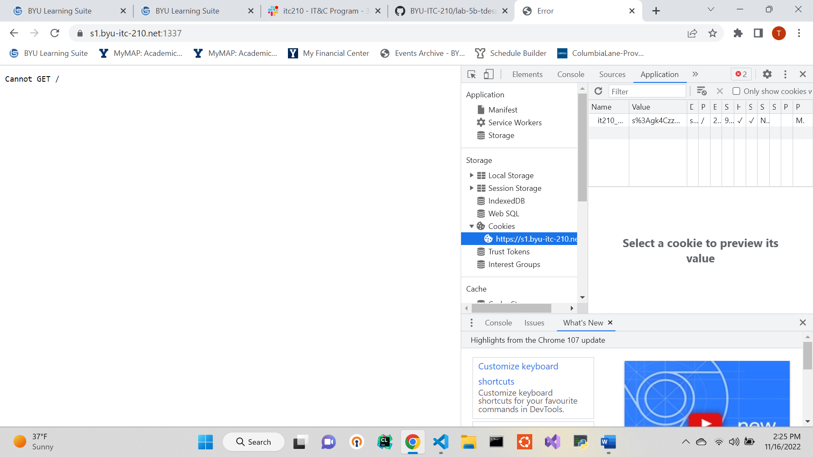
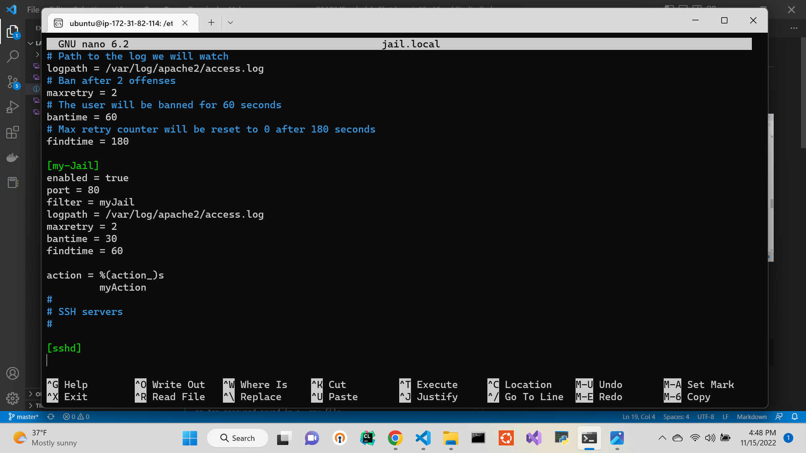

# Introduction
Lab 5 Writeup

Tanner Despain

11/16/2022

# Executive Summary
    In lab 5a I performed a series of unit tests on several server endpoints using Python. I wrote methods to perform each of the different CRUD functions and corresponding tests to make sure each function performed correctly.

    In lab 5b I performed server hardening to prevent DoS attacks on my live AWS server. Using a custom Jail and regex I prevented an attacker from brute forcing a path onto my website by checking for 404s in the server logs.

# Design Overview
Lab 5a files: 

    api.py: contains the CRUD functions for the tasks webpage

    test_api.py: contains the 12 different unit tests for the 4 servers
 
 Obtaining a cookie from the server

Lab 5b files: 

	jail.local: contains the parameters for my custom jail and actions

	jail.conf: contains the regex for checking the logs
	myAction.conf: contains the file path for the python script

	python_ban.py: contains the script that upon banning an ip address, sends me an email
 
 
The details for my custom Jail

 
The regex for checking the logs with the ignored ip address

# Questions
1.	Name and discuss at least two of the benefits of writing unit tests before writing code
a.	Unit tests can find invalid situations that don’t happen under normal circumstances, this helps you to write better code that accounts for every possible situation.
b.	They can also help gauge the performance of your web service so that you know the limits of the software
2.	Test automation reduces human interaction with the code thus resulting in more consistent and reliable results.
3.	10ish hours?

# Lessons Learned

1. How to test the CRUD functions in the api with a main function:
    - At first the main function doesnt seem to be of much use, you define some variables there but its hard to know what else to do. I had trouble knowing what functions to call and what parameters they take. I learned that the best way to test my methods was to call them one by one and return its response, commenting out the functions that I didnt need, rather than trying to test all at once.

2. Using regex to match the desired logs
    - Regex can be very picky, which is the purpose of it, and can be difficult to math exactly what you want. I was searching for 404 errors in the file, but did not phrase my regex correctly. It was searching for 404 at the end of the file, I forgot the .* to signify any following characters. After adding that it worked properly.

3. Using a .env file on the live server
    - Using a .env file is useful for hiding sensitive information, I had trouble linking it to my python script. This happens when certain python packages are not installed correctly. I had installed python-decouple without using "sudo" and so the script did not know what it was. After installing it correctly it worked perfectly.

# Conclusion

- Write Python script
- Unit Test
- Use Shebangs
- Utilize test driven development
- Create custom Jails
- Call python scripts with Actions

# References

https://staffwww.fullcoll.edu/sedwards/nano/UsefulNanoKeyCommands.html (usefull nano commands)

https://realpython.com/python-send-email/ (sending email with python scripts)

https://support.google.com/accounts/answer/185833?hl=en (creating a google app password for sending emails)